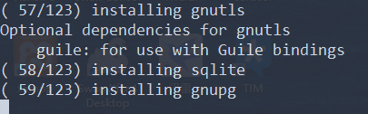

# manjaro-linux-for-wsl
为 windows 10 WSL 而做的 Manjaro Linux 发行版本

该项目最初版本是基于 [manjaro-bootstrap](https://gitlab.manjaro.org/tools/maintenance-tools/manjaro-bootstrap) 而做的,
从 2019-05-06 版本开始，就使用 python3 重写并优化了 manjaro-bootstrap 的逻辑

## 内置软件

该发行版本只打包了最基本的软件, 以及有用的开发工具

* gzip, zip, unzip
* net-tools
* dnsutils
* iproute2
* iputils
* zsh
* tmux
* python3, pip3
* neovim
* dbus
* [pywslpath](https://github.com/riag/pywslpath)

## 下载

可以从百度网盘下载已经打包好的 tar 文件

最新 release 版本(2019-05-26): https://pan.baidu.com/s/1OXZB6iQRA3h0NtuLoOZjWg  , 提取码为 m8j4

2018-11-06 版本  : https://pan.baidu.com/s/1e4VN2lcWXXlipTLDMrwujw


## 安装

下载 tar 文件或者自己打包 tar 文件后，建议使用 [LxRunOffline](https://github.com/DDoSolitary/LxRunOffline) 来安装，可以使用下面命令来安装

```
LxRunOffline.exe install -n manjaro-linux -f ../manjaro-linux-wsl-x86_64-2018-11-05.tar.gz -d G:\devel\wsl\manjaro-linux -r root.x86_64
```

**注意** 要修改上面安装命令的参数要实际的值

## 使用

### 使用 windows 系统内置的 `bash` 命令
  把 manjaro linux 安装成功后，需要把它设为默认分发版才行使用 `bash` 命令来启动

### wsltty-launcher 工具
  建议使用 [wsltty-launcher](https://github.com/riag/wsltty-launcher) 工具来启动，该工具已经默认设置了以下 3 个环境变量
  ```
  WSL_DISTRO_NAME : 当前 WSL Linux 的 distro name
  WSL_DISTRO_GUID : 当前 WSL Linux 的 distro guid
  WSL_DISTRO_ROOTFS_DIR  : 当前 WSL Linux 的 distro rootfs 路径
  ```

## 打包

  打包脚本采用 Python 语言开发

### 依赖软件
  安装以下工具
* [Python 3.5+](https://www.python.org/)
* [python-pipenv](https://github.com/pypa/pipenv) 

#### 安装依赖包
  使用以下命令安装依赖包
  ```
pipenv install --dev
  ```

### 打包
  使用以下命令打包
 ```
pipenv run python3 build.py -a x86_64 -w ~/manjaro-linux-rootfs
 ```

 **注意**: 第一次执行该命令时，会卡在一个地方(见下图)，直接按 `Ctrl+C` 中断打包过程，再执行一次该命令就好了



 打包成功后，压缩文件放在 `当前目录/dist` 目录下

## 参数说明

```
-a/--arch       CPU 架构，默认是 x86_64
-r/--repo       下载依赖包的 repo，默认是 https://mirrors.tuna.tsinghua.edu.cn/manjaro
-w/--work-dir   指定工作目录，默认是 当前目录/build 
```
